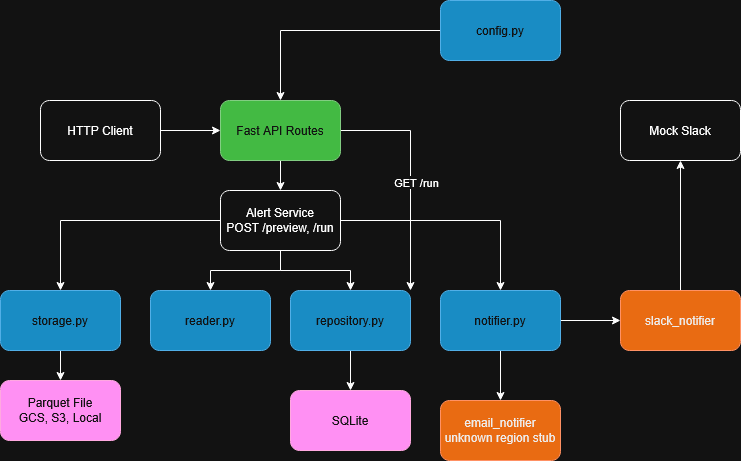

# Risk Alert Service

Reads monthly account health data from Parquet, identifies at-risk accounts, and sends Slack alerts to region-specific channels. Supports re-running the same month safely — no duplicate alerts.

## Architecture



---

## Quickstart (local)

```bash
python -m venv .venv && source .venv/bin/activate
pip install -r requirements.txt
cp .env.example .env  # fill in your values
uvicorn app.main:app --reload --port 8000
```

```bash
curl http://localhost:8000/health
```

---

## Configuration

### Environment Variables

| Variable | Default | Description |
|----------|---------|-------------|
| `SLACK_WEBHOOK_BASE_URL` | — | Base URL for mock/test Slack server. Takes precedence over `SLACK_WEBHOOK_URL`. |
| `SLACK_WEBHOOK_URL` | — | Single Slack incoming webhook URL (real Slack). |
| `DETAILS_BASE_URL` | `https://app.yourcompany.com` | Base URL for account detail links in alerts. |
| `ARR_THRESHOLD` | `10000` | Minimum ARR (USD) to include in alerts. See note below. |
| `HISTORY_MONTHS` | `24` | How many months of history to load for duration calculation. |
| `SLACK_MAX_RETRIES` | `3` | Max retry attempts for failed Slack sends. |
| `SLACK_BACKOFF_BASE` | `1.0` | Base backoff in seconds (doubles each retry). |
| `SLACK_BACKOFF_MAX` | `30.0` | Maximum backoff cap in seconds. |
| `SQLITE_PATH` | `./risk_alerts.db` | Path to SQLite database. |
| `ESCALATION_EMAIL` | `support@quadsci.ai` | Email address for unknown-region escalation summary. |
| `SAMPLE_LIMIT` | `5` | Max alerts/errors returned in `GET /runs/{id}` response. |
| `GOOGLE_APPLICATION_CREDENTIALS` | — | Path to GCP service account JSON. |
| `AWS_ACCESS_KEY_ID` | - | Access ID
| `AWS_SECRET_ACCESS_KEY` | - | Secret Key
| `AWS_DEFAULT_REGION` | us-east-1 | AWS Region
| `PARQUET_FILE` | - | Path to local parquet file. For docker use |

*At least one Slack URL must be set. If both are set, `SLACK_WEBHOOK_BASE_URL` takes precedence.

### `config.json`

Region-to-channel routing is configured in `config.json` at the project root:

```json
{
  "regions": {
    "AMER": "amer-risk-alerts",
    "EMEA": "emea-risk-alerts",
    "APAC": "apac-risk-alerts"
  }
}
```

If an account's region is missing or not in this map, no Slack alert is sent. The account is recorded as `failed` with reason `unknown_region`, and included in a single aggregated summary logged after the run (see [Unknown Regions](#unknown-regions)).

### ARR Threshold

The default threshold is **$10,000**. Accounts below this are excluded from alerting entirely. The intent is to reduce noise from small or inactive accounts — at-risk alerts are most actionable for accounts with meaningful revenue exposure. In the dataset, accounts with `arr=0` are typically churned or trial accounts. Override with `ARR_THRESHOLD`.

---

## GCS Auth

```bash
# Service account key
export GOOGLE_APPLICATION_CREDENTIALS=/path/to/service_account.json

# Or use Workload Identity (GKE / Cloud Run) — no key file needed
```

---

## API

### `POST /runs`

Processes a month synchronously. Reads Parquet, computes alerts, sends Slack messages, persists results. Blocks until complete.

```bash
curl -s -X POST http://localhost:8000/runs \
  -H "Content-Type: application/json" \
  -d '{"source_uri": "gs://fde-take-home-asantos/monthly_account_status.parquet", "month": "2026-01-01", "dry_run": false}' \
  | python3 -m json.tool
```

```json
{"run_id": "8cc57b57-f506-45bc-80bc-4c253fba794e"}
```

### `GET /runs/{run_id}`

Returns persisted run results.

```bash
curl -s http://localhost:8000/runs/8cc57b57-f506-45bc-80bc-4c253fba794e | python3 -m json.tool
```

```json
{
  "run_id": "8cc57b57-f506-45bc-80bc-4c253fba794e",
  "status": "succeeded",
  "month": "2026-01-01",
  "dry_run": false,
  "counts": {
    "rows_scanned": 1868,
    "alerts_sent": 137,
    "skipped_replay": 0,
    "failed_deliveries": 0,
    "duplicate_count": 58,
    "unknown_regions": 4
  },
  "sample_alerts": [
    {
      "account_id": "a00636",
      "account_name": "Account 0636",
      "channel": "emea-risk-alerts",
      "status": "sent",
      "error": null
    },
    {
      "account_id": "a00076",
      "account_name": "Account 0076",
      "channel": "apac-risk-alerts",
      "status": "sent",
      "error": null
    },
    {
      "account_id": "a00570",
      "account_name": "Account 0570",
      "channel": "amer-risk-alerts",
      "status": "sent",
      "error": null
    },
    {
      "account_id": "a00377",
      "account_name": "Account 0377",
      "channel": "emea-risk-alerts",
      "status": "sent",
      "error": null
    },
    {
      "account_id": "a00288",
      "account_name": "Account 0288",
      "channel": "emea-risk-alerts",
      "status": "sent",
      "error": null
    }
  ],
  "sample_errors": [
    {
      "account_id": "a00090",
      "account_name": "Account 0090",
      "channel": null,
      "status": "failed",
      "error": "unknown_region"
    }
  ]
}
```

**Replay of same month** — idempotency in action:

```json
{
  "counts": {
    "alerts_sent": 0,
    "skipped_replay": 137,
    "failed_deliveries": 0,
    "unknown_regions": 4
  }
}
```

### `POST /preview`

Same as `/runs` but does not send Slack messages or persist anything. Useful for validating what would be sent before committing.

```bash
curl -s -X POST http://localhost:8000/preview \
  -H "Content-Type: application/json" \
  -d '{"source_uri": "gs://fde-take-home-asantos/monthly_account_status.parquet", "month": "2026-01-01", "dry_run": false}' \
  | python3 -m json.tool
```

```json
{
  "month": "2026-01-01",
  "alert_count": 141,
  "alerts": [
    {
      "account_id": "a00636",
      "account_name": "Account 0636",
      "account_region": "EMEA",
      "month": "2026-01-01",
      "arr": 10211,
      "renewal_date": "2026-06-01",
      "account_owner": "owner36@example.com",
      "duration_months": 2,
      "risk_start_month": "2025-12-01"
    },
    {
      "account_id": "a00288",
      "account_name": "Account 0288",
      "account_region": "EMEA",
      "month": "2026-01-01",
      "arr": 56745,
      "renewal_date": null,
      "account_owner": "owner38@example.com",
      "duration_months": 5,
      "risk_start_month": "2025-09-01"
    }
  ]
}
```

### `GET /health`

```json
{"ok": true, "db": true}
```

---

## Alert Logic

For a given month, the service alerts on all accounts where `status == "At Risk"` and `arr >= ARR_THRESHOLD`.

**Duration** is computed by walking backward month-by-month until the status changes or a month is missing. A gap or healthy month resets the count.

```
2025-10  At Risk
2025-11  At Risk
2025-12  Healthy   ← breaks streak
2026-01  At Risk   → duration = 1
```

---

## Replay Safety

Alert outcomes are persisted in SQLite with a uniqueness constraint on `(account_id, month, alert_type)`. On rerun:

- Already sent → skipped, counted as `skipped_replay`
- Previously failed → retried (e.g. accounts that hit max retries on 429s will be retried on the next run)

---

## Unknown Regions

Accounts with a missing or unmapped `account_region` are not sent to Slack. They are recorded as `failed` with `error="unknown_region"`. After each run, a single aggregated summary of all unrouted accounts is logged.

**In production** this would use a real email sender (e.g. SendGrid, SES). Currently it logs a warning in the format:

```
[EMAIL STUB] To: support@quadsci.ai | Subject: [Risk Alerts] Unrouted accounts | Body: ...
```

---

## Slack Integration

The service supports two modes:

- **Base URL mode** — set `SLACK_WEBHOOK_BASE_URL`. Posts to `{base_url}/{channel}`. Used with the included mock Slack server.
- **Single webhook mode** *(optional, not exercised)* — set `SLACK_WEBHOOK_URL`. Posts all alerts to one URL. Wiring is in place but untested against a live Slack workspace.

If both are set, `SLACK_WEBHOOK_BASE_URL` takes precedence.

Retries on HTTP 429 and 5xx with exponential backoff. Honors `Retry-After` header when present.

### Mock Slack Server

A lightweight mock server is included for testing:

```bash
uvicorn mock_slack.server:app --host 0.0.0.0 --port 9000
```

View received messages:
```bash
curl -s "http://localhost:9000/logs?limit=20" | python3 -c "
import json, sys
data = json.load(sys.stdin)
for r in data['records']:
    if r['status_code'] == 200:
        print(f\"[{r['ts']}] #{r['channel']}\")
        print(r['payload']['text'])
        print()
"
```

Enable failure simulation to test retries:
```bash
MOCK_SLACK_FAIL_RATE_429=0.20 MOCK_SLACK_FAIL_RATE_500=0.10 \
uvicorn mock_slack.server:app --host 0.0.0.0 --port 9000
```

---

## Docker

### Setup

Create a `.env.docker` file (not committed) with your machine-specific paths (or you may export them / edit the .env file):

```bash
# .env.docker
GOOGLE_APPLICATION_CREDENTIALS=/secrets/gcp.json
SLACK_WEBHOOK_BASE_URL=http://host.docker.internal:9000/slack/webhook
```


Get your local paths with:
```bash
realpath monthly_account_status.parquet
realpath your_service_account.json
```

`.env` handles all service config. `.env.docker` overrides the two values that differ inside Docker (`GOOGLE_APPLICATION_CREDENTIALS`, `SLACK_WEBHOOK_BASE_URL`) and supplies machine-specific volume paths (`GCP_KEY_PATH`, `PARQUET_PATH`).

### Build and run

```bash
cp .env.example .env          # fill in your values
cp .env.docker.example .env.docker  # fill in your local paths
docker-compose up --build
```

### Testing with a local Parquet file

Once the Parquet path is mounted via `PARQUET_PATH`, use `file://` as the source URI:

```bash
curl -s -X POST http://localhost:8000/runs \
  -H "Content-Type: application/json" \
  -d '{"source_uri": "file:///data/monthly_account_status.parquet", "month": "2026-01-01", "dry_run": false}' \
  | python3 -m json.tool
```

---

## Testing

```bash
# terminal 1 — start mock Slack server
uvicorn mock_slack.server:app --host 0.0.0.0 --port 9000

# terminal 2 — start service via Docker
docker-compose up --build

# health check
curl -s http://localhost:8000/health | python3 -m json.tool

# preview (no Slack, no DB writes)
curl -s -X POST http://localhost:8000/preview \
  -H "Content-Type: application/json" \
  -d '{"source_uri": "gs://fde-take-home-asantos/monthly_account_status.parquet", "month": "2026-01-01", "dry_run": false}' \
  | python3 -m json.tool

# clean run
curl -s -X POST http://localhost:8000/runs \
  -H "Content-Type: application/json" \
  -d '{"source_uri": "gs://fde-take-home-asantos/monthly_account_status.parquet", "month": "2026-01-01", "dry_run": false}' \
  | python3 -m json.tool

# check results (replace RUN_ID)
curl -s http://localhost:8000/runs/RUN_ID | python3 -m json.tool

# verify Slack messages received
curl -s "http://localhost:9000/logs?limit=10" | python3 -c "
import json, sys
data = json.load(sys.stdin)
for r in data['records']:
    if r['status_code'] == 200:
        print(f\"[{r['ts']}] #{r['channel']}\")
        print(r['payload']['text'])
        print()
"

# replay same month — should show skipped_replay: 137, alerts_sent: 0
curl -s -X POST http://localhost:8000/runs \
  -H "Content-Type: application/json" \
  -d '{"source_uri": "gs://fde-take-home-asantos/monthly_account_status.parquet", "month": "2026-01-01", "dry_run": false}' \
  | python3 -m json.tool

# reset DB if needed
docker-compose down && rm -f risk_alerts.db && docker-compose up
```

### Unit tests

```bash
pytest tests/ -v
```

---

## Storage URIs

| Scheme | Example |
|--------|---------|
| Local | `file:///data/monthly_account_status.parquet` |
| GCS | `gs://my-bucket/path/to/file.parquet` |
| S3 | `s3://my-bucket/path/to/file.parquet` |

S3 support follows the same pattern as GCS (`pyarrow.fs.S3FileSystem`). AWS credentials are picked up from the environment via the standard boto3 credential chain.

---

## Project Structure

```
app/
├── main.py          # FastAPI routes
├── service.py       # Orchestration
├── reader.py        # Parquet reading and alert computation
├── repository.py    # SQLite persistence
├── notifier.py      # Slack and email notifiers
├── storage.py       # URI → filesystem abstraction
├── config.py        # Configuration loading
├── dependencies.py  # FastAPI dependency injection
└── models.py        # Shared Pydantic models

mock_slack/
└── server.py        # Local Slack webhook mock

tests/               # Unit tests
```
